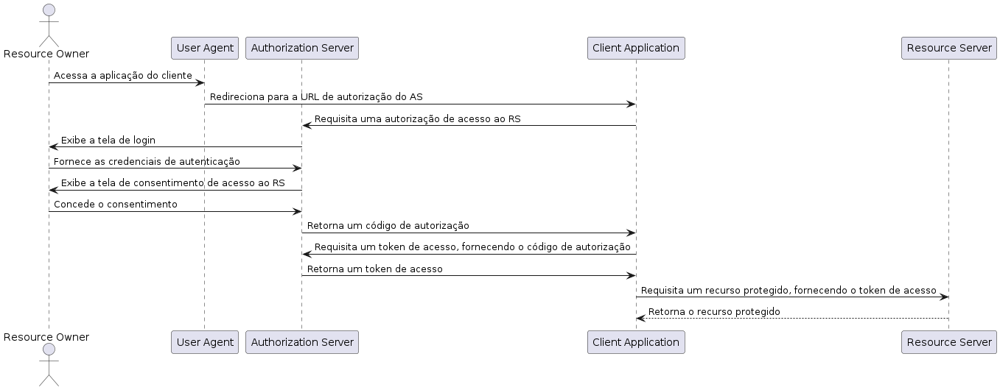

# quarkus-multitenancy-keycloak
Exemplo de aplicação de uma api multi tenancy utilizando Quarkus e Keycloak

## Multitenancy com Hibernate

### Habilitando multi tenant com Schema

```properties
quarkus.http.port=8005
quarkus.datasource.db-kind=postgresql
quarkus.datasource.jdbc.url=jdbc:postgresql://${DB_URL:localhost}:5432/${DB_NAME:syncdb-test}
quarkus.datasource.username=${DB_USERNAME:syncdb-username}
quarkus.datasource.password=${DB_PASSWORD:syncdb-password}
quarkus.hibernate-orm.multitenant=SCHEMA
quarkus.flyway.schemas=tenant01,tenant02
quarkus.flyway.migrate-at-start=true
```

### Habilitando multi tenant com Database

```properties
quarkus.hibernate-orm.multitenant=DATABASE
quarkus.flyway.migrate-at-start=true
# conexão default
quarkus.datasource.db-kind=postgresql
quarkus.datasource.username=postgres
quarkus.datasource.password=postgres
quarkus.datasource.jdbc.url=jdbc:postgresql://localhost:5432/cliente01

# conexão cliente01
quarkus.datasource.cliente01.db-kind=postgresql
quarkus.datasource.cliente01.username=postgres
quarkus.datasource.cliente01.password=postgres
quarkus.datasource.cliente01.jdbc.url=jdbc:postgresql://localhost:5432/cliente01
quarkus.flyway.cliente01.migrate-at-start=true

# conexão cliente02
quarkus.datasource.cliente02.db-kind=postgresql
quarkus.datasource.cliente02.username=postgres
quarkus.datasource.cliente02.password=postgres
quarkus.datasource.cliente02.jdbc.url=jdbc:postgresql://localhost:5432/cliente02
quarkus.flyway.cliente02.migrate-at-start=true

```

## Autenticação com Key Cloak

### Gerando Access token do Realm

Após criar o client no healm no key cloak poderá ser realizado está requisição para obter o acess token

```http
POST http://localhost:8080/realms/fullcycle-realm/protocol/openid-connect/token
Content-Type: application/x-www-form-urlencoded

username=user@user.com
&password=secret
&grant_type=password
&client_id=fullcycle-client
```


### Gerando Access Token e Open Id

O Open id token é um token mais resumido de informações.

```http
POST http://localhost:8080/realms/fullcycle-realm/protocol/openid-connect/token
Content-Type: application/x-www-form-urlencoded

username=user@user.com
&password=secret
&grant_type=password
&client_id=fullcycle-client
&scope=openid
```

## Fluxos de autenticação

- Os fluxos de autenticação utilizando Keycloak estão separados por branches

### Authorization Code

- Geralmente recomendado para aplicativos web e móveis confiáveis
- Fornece alto nível ao lidar com autorização e autenticação de usuários em um servidor de recursos
- É adequado que você possui um servidor back-end seguro que protege o segredo de cliente (client-secret)
- O aplicativo solicita ao servidor de autorização (authorization server) um código de autorização, que é então trocado por um token de acesso. Essa troca ocorre no servidor back-end, onde as credenciais confidenciais podem ser armazenadas com segurança e a comunicação é realizada por meio de chamadas de back-end.
- Em resumo, o fluxo Authorization Code Flow é recomendado para aplicativos web e móveis confiáveis, nos quais a segurança é uma preocupação essencial e existe um servidor back-end seguro para gerenciar as interações com o servidor de autorização.